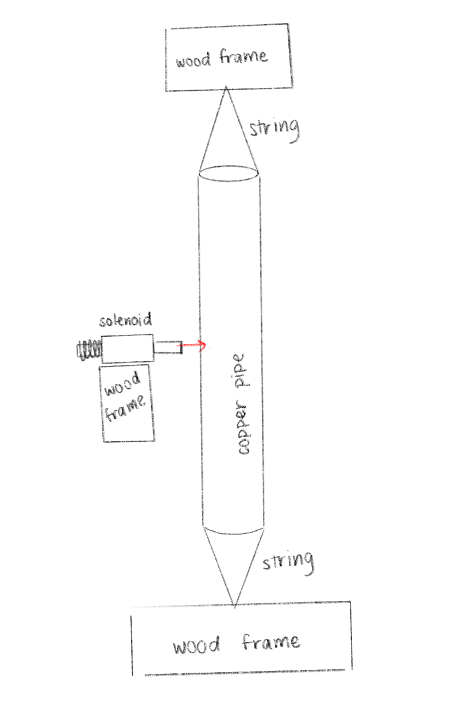
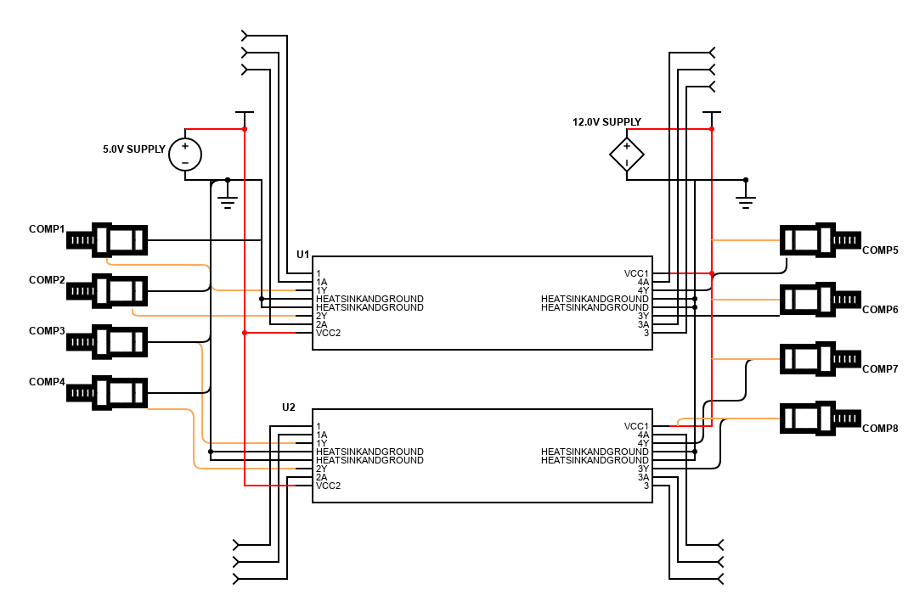

# MU2801-FINAL
Final Project for Making Music With Machines (MU2801)  
Dylan, Evelyn, Peter, Declan

# What is the idea?
The idea for the project is to automate a "hanging xylophone" type of instrument using solenoids to strike hanging copper pipes suspended from a wooden frame. The designs and schematic below show how the project would function with regards to its structure and electronics. The instrument would be able to play songs and chords withing the range of one octave, as seen in the code.

# Electronics List
- 8 solenoids (ordered)
- jumper wires (already have)
- arduino (already have)
- breadboards (already have)
- 2 hbridges (ordered)
- spool of wire (ordered)
- 12v power supply (already have)

# Other Materials
- 16' of 2" x 4"
- 10' of copper pipe (.5" diameter)
- string / twine
- screws (size tbd)
- metal drill bit?
- hacksaw

# Designs

# Calculations
assuming we use 9' of the copper pipe   
one octave higher of a pipe, size X, is 0.7071X  
one semitone higher of a pipe, size X, is 0.9715X  

do (lower octave)   1' 4.0572"  
re                  1' 3.15492"  
mi                  1' 2.3034"  
fa                  1' 1.89576"  
so                  1' 1.11492"  
la                  1' 0.37812"  
ti                  0' 11.6826"  
do (higher octave)  0' 11.35404"  
